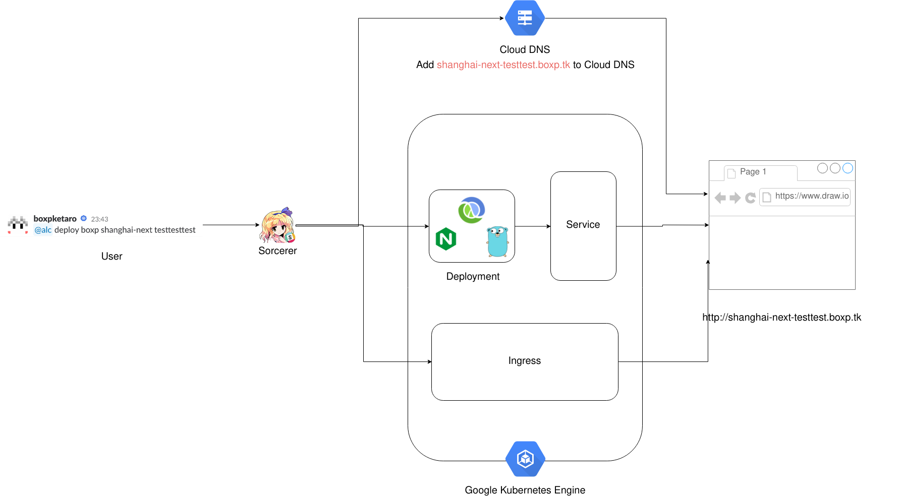

# Sorcerer

A Slackbot for Deploying microservices to GKE Cluster.

## Prerequisites

- Leiningen(https://leiningen.org/)

### Optionals(For GKE Cluster)

- Google Cloud SDK(https://cloud.google.com/sdk/)
- Your GCP Account
- Your AWS Account

## Usage(Local Environment)

1. Add `.lein-env` to root folder(Examples below).

```clj
{:sorcerer-slack-token "[SLACK_TOKEN]"
 :sorcerer-github-oauth-token "[GITHUB_OAUTH_TOKEN]"
 :sorcerer-aws-access-key "[AWS_ACCESS_KEY]"
 :sorcerer-aws-secret-key "[AWS_SECRET_KEY]"
 :sorcerer-dynamodb-endpoint "http://localhost:8000"
 :sorcerer-pubsub-subscription-name "sorcerer-cloud-builds-dev"
 :sorcerer-k8s-endpoint "http://localhost:8001"
 :sorcerer-k8s-ingress-name "[YOUR_K8S_INGRESS_NAME]"
 :sorcerer-k8s-namespace "[YOUR_K8S_NAMESPACE]"
 :sorcerer-k8s-domain "[YOUR_DOMAIN_NAME]"
 :sorcerer-dns-zone "[YOUR_CLOUD_DNS_ZONE]"}
```

2. `lein repl`
3. `(go)`

## Deploy to your GKE cluster

1. Add Integration with [Google Cloud Container Builder](https://cloud.google.com/container-builder/docs/running-builds/automate-builds) to your GitHub repository.
2. Add Kubernetes Engine IAM role.(quoted from [Official Document](https://cloud.google.com/container-builder/docs/configuring-builds/build-test-deploy-artifacts#deploying_artifacts))
	1. visit [IAM menu](https://console.cloud.google.com/iam-admin/iam/project?_ga=2.85671577.-1255311422.1517556095).
	2. From the list of service accounts, click the Roles drop-down menu beside the Container Builder [YOUR-PROJECT-ID]@cloudbuild.gserviceaccount.com service account.
	3. Click *Kubernetes Engine*, then click *Kubernetes Engine Admin*.
	4. Click Save.

```yml
apiVersion: v1
kind: Secret
metadata:
  name: sorcerer
type: Opaque
data:
  slack-token: <echo -n "[SLACK_TOKEN]" | base64> # for slack
  github-oauth-token: <echo -n "[GITHUB_OAUTH_TOKEN]" | base64> # for github
  aws-access-key: <echo -n "[AWS_ACCESS_KEY]" | base64> # for dynamodb
  aws-secret-key: <echo -n "[AWS_SECRET_KEY]" | base64> # for dynamodb
  dynamodb-endpoint: <echo -n "http://localhost:8001" | base64> # for dynamodb
  pubsub-subscription-name: <echo -n "sorcerer-cloud-builds" | base64> # for cloud pubsub
  k8s-domain: <echo -n "[YOUR_DOMAIN_NAME]" | base64>
  k8s-ingress-name: <echo -n "[YOUR_K8S_INGRESS_NAME]" | base64>
  dns-zone: <echo -n "[YOUR_CLOUD_DNS_ZONE]" | base64> # for cloud dns
```

4. Just `git push` commits.

## Usage

1. Create your mirror repository from github to Google Source Repository.
2. Add `puppet.edn` to repository root folder(Examples below).

```clj
;; for more information: https://cloud.google.com/container-builder/docs/build-config#build_steps
{:steps [{:name "gcr.io/cloud-builders/docker"
          :args ["build", "-t", "asia.gcr.io/$PROJECT_ID/sample-app:$COMMIT_SHA", "."]}]
 :images {:sample-app "asia.gcr.io/$PROJECT_ID/sample-app:$COMMIT_SHA"}
 :k8s {:deployment "k8s/deployment.yml"
       :service "k8s/service.yml"}}
```

3. Send mention to sorcerer `@<your-bot-name> deploy <repository-user-name> <repository-name> <branch-name>`

## License

Copyright © 2018 boxp

Distributed under the Eclipse Public License either version 1.0 or (at
your option) any later version.

## Thanks

- [旧作アリス立ち絵 表情差分](https://www.pixiv.net/member_illust.php?mode=medium&illust_id=54550636) by [dairi](https://www.pixiv.net/member.php?id=4920496)
